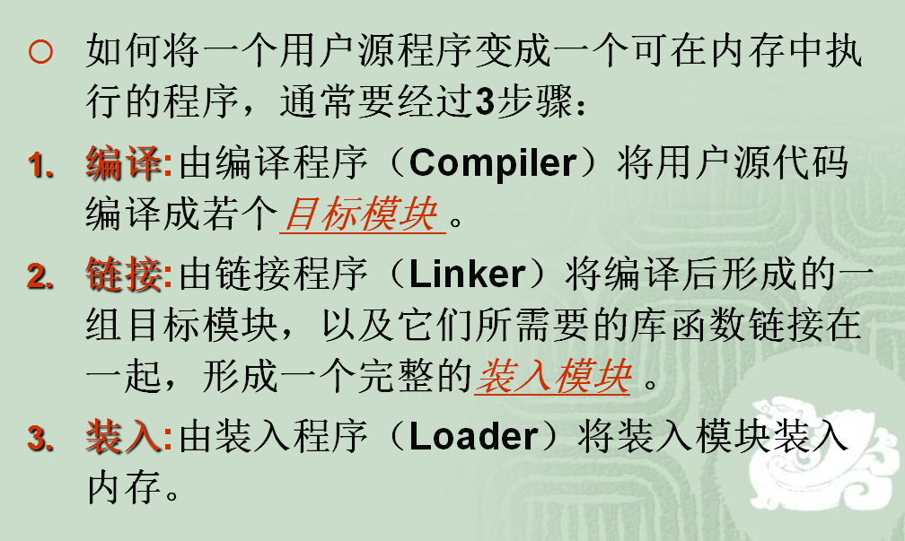
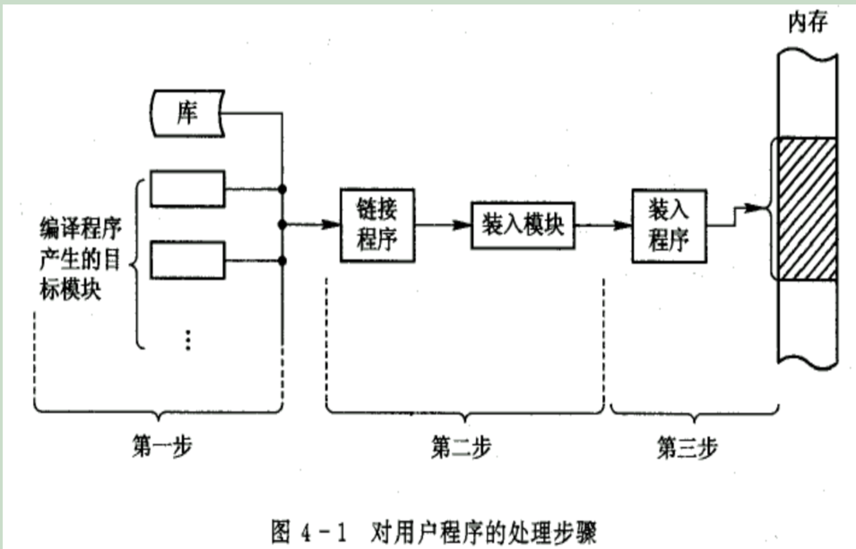

# 面向对象的JavaScript
## 1.1 动态类型语言和鸭子类型
### 语言类型
书上主要解释了`静态类型语言`和`动态类型语言`的区别。看到这里我想到了之前在学校里操作系统上课时讲到的内存管理的内容，回去大概翻了一下学校老师的课件。所以这里讲一下语言的类型。



源代码经过`编译`->`链接`->`装入`后变成内存中可执行的程序。这里课堂上讲到应该是指编译型语言。我们知道`JavaScript`应该是不需要编译这个过程的。



#### 编译型和解释型
打个比方：假如你打算阅读一本外文书，而你不知道这门外语，那么你可以找一名翻译，给他足够的时间让他从头到尾把整本书翻译好，然后把书的母语版交给你阅读；或者，你也立刻让这名翻译辅助你阅读，让他一句一句给你翻译，如果你想往回看某个章节，他也得重新给你翻译。 

##### 编译型
有一个负责翻译的程序来对我们的源代码进行转换，生成相对应的可执行代码。这个过程说得专业一点，就称为`编译（Compile）`，而负责编译的程序自然就称为`编译器（Compiler）`。如果我们写的程序代码都包含在一个源文件中，那么通常编译之后就会直接生成一个可执行文件，我们就可以直接运行了。但对于一个比较复杂的项目，为了方便管理，我们通常把代码分散在各个源文件中，作为不同的模块来组织。这时编译各个文件时就会生成目标文件（Object file）而不是前面说的可执行文件。一般一个源文件的编译都会对应一个目标文件。这些目标文件里的内容基本上已经是可执行代码了，但由于只是整个项目的一部分，所以我们还不能直接运行。

待所有的源文件的编译都大功告成，我们就可以最后把这些半成品的目标文件“打包”成一个可执行文件了，这个工作由另一个程序负责完成，由于此过程好像是把包含可执行代码的目标文件连接装配起来，所以又称为`链接（Link）`，而负责链接的程序就叫……就叫`链接程序（Linker）`。链接程序除了链接`目标文件`、`标准库`外，可能还有各种资源，像图标文件啊、声音文件啊什么的，还要负责去除目标文件之间的冗余重复代码，等等，所以……也是挺累的。链接完成之后，一般就可以得到我们想要的可执行文件了。

注：这里拓展讲一下OS课上讲的程序链接和装入过程。
##### 解释型
在程序运行的前一刻，还只有源程序而没有可执行程序；而程序每执行到源程序的某一条指令，则会有一个称之为解释程序的外壳程序将源代码转换成二进制代码以供执行，总言之，就是不断地解释、执行、解释、执行……所以，解释型程序是离不开解释程序的。像早期的BASIC就是一门经典的解释型语言，要执行BASIC程序，就得进入BASIC环境，然后才能加载程序源文件、运行。解释型程序中，由于程序总是以源代码的形式出现，因此只要有相应的解释器，移植几乎不成问题。编译型程序虽然源代码也可以移植，但前提是必须针对不同的系统分别进行编译，对于复杂的工程来说，的确是一件不小的时间消耗，况且很可能一些细节的地方还是要修改源代码。而且，解释型程序省却了编译的步骤，修改调试也非常方便，编辑完毕之后即可立即运行，不必像编译型程序一样每次进行小小改动都要耐心等待漫长的Compiling…Linking…这样的编译链接过程。不过凡事有利有弊，由于解释型程序是将编译的过程放到执行过程中，这就决定了解释型程序注定要比编译型慢上一大截。

显然`JavaScript`是一门解释型语言。

有的语言可能既具备编译型的特点又具备解释型的特点，例如`Java`？

[Java 是编译型语言还是解释型语言？](https://www.zhihu.com/question/19608553)

一批新兴的语言都有把两者折衷起来的趋势，例如Java语言虽然比较接近解释型语言的特征，但在执行之前已经预先进行一次预编译，生成的代码是介于机器码和Java源代码之间的中介代码，运行的时候则由JVM（Java的虚拟机平台，可视为解释器）解释执行。它既保留了源代码的高抽象、可移植的特点，又已经完成了对源代码的大部分预编译工作，所以执行起来比“纯解释型”程序要快许多。而像VB6（或者以前版本）、C#这样的语言，虽然表面上看生成的是.exe可执行程序文件，但VB6编译之后实际生成的也是一种中介码，只不过编译器在前面安插了一段自动调用某个外部解释器的代码（该解释程序独立于用户编写的程序，存放于系统的某个DLL文件中，所有以VB6编译生成的可执行程序都要用到它），以解释执行实际的程序体。C#（以及其它.net的语言编译器）则是生成.net目标代码，实际执行时则由.net解释系统（就像JVM一样，也是一个虚拟机平台）进行执行。当然.net目标代码已经相当“低级”，比较接近机器语言了，所以仍将其视为编译语言，而且其可移植程度也没有Java号称的这么强大，Java号称是“一次编译，到处执行”，而.net则是“一次编码，到处编译”。呵呵，当然这些都是题外话了。总之，随着设计技术与硬件的不断发展，编译型与解释型两种方式的界限正在不断变得模糊。

#### 强类型定义语言和弱类型定义语言
这个想必大家都清楚，例如`C/C++`是强类型的，一旦一个变量被指定了某个数据类型，如果不经过强制转换，那么它就永远是这个数据类型了。
##### C++
```C++
int anInteger;
char aString;
```
##### Python
Python其实是强类型语言。

```
>>> "6"-"3"
Traceback (most recent call last):
  File "<stdin>", line 1, in <module>
TypeError: unsupported operand type(s) for -: 'str' and 'str'
```

##### JavaScript
很明显的是弱类型语言
```javascript
var a;
let b;
const c;
console.log("2" - "1"); // 1
```