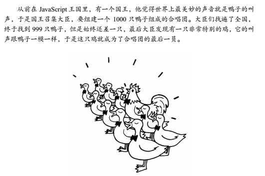

# 面向对象的JavaScript
## 1.1 动态类型语言和鸭子类型
### 语言类型
书上主要解释了`静态类型语言`和`动态类型语言`的区别。看到这里我想到了之前在学校里操作系统上课时讲到的内存管理的内容，回去大概翻了一下学校老师的课件。所以这里讲一下语言的类型。


源代码经过`编译`->`链接`->`装入`后变成内存中可执行的程序。这里课堂上讲到应该是指编译型语言。我们知道`JavaScript`应该是不需要编译这个过程的。


#### 编译型和解释型
打个比方：假如你打算阅读一本外文书，而你不知道这门外语，那么你可以找一名翻译，给他足够的时间让他从头到尾把整本书翻译好，然后把书的母语版交给你阅读；或者，你也立刻让这名翻译辅助你阅读，让他一句一句给你翻译，如果你想往回看某个章节，他也得重新给你翻译。 

##### 编译型
有一个负责翻译的程序来对我们的源代码进行转换，生成相对应的可执行代码。这个过程说得专业一点，就称为`编译（Compile）`，而负责编译的程序自然就称为`编译器（Compiler）`。如果我们写的程序代码都包含在一个源文件中，那么通常编译之后就会直接生成一个可执行文件，我们就可以直接运行了。但对于一个比较复杂的项目，为了方便管理，我们通常把代码分散在各个源文件中，作为不同的模块来组织。这时编译各个文件时就会生成目标文件（Object file）而不是前面说的可执行文件。一般一个源文件的编译都会对应一个目标文件。这些目标文件里的内容基本上已经是可执行代码了，但由于只是整个项目的一部分，所以我们还不能直接运行。

待所有的源文件的编译都大功告成，我们就可以最后把这些半成品的目标文件“打包”成一个可执行文件了，这个工作由另一个程序负责完成，由于此过程好像是把包含可执行代码的目标文件连接装配起来，所以又称为`链接（Link）`，而负责链接的程序就叫……就叫`链接程序（Linker）`。链接程序除了链接`目标文件`、`标准库`外，可能还有各种资源，像图标文件啊、声音文件啊什么的，还要负责去除目标文件之间的冗余重复代码，等等，所以……也是挺累的。链接完成之后，一般就可以得到我们想要的可执行文件了。

注：这里拓展讲一下OS课上讲的程序链接和装入过程。
##### 解释型
在程序运行的前一刻，还只有源程序而没有可执行程序；而程序每执行到源程序的某一条指令，则会有一个称之为解释程序的外壳程序将源代码转换成二进制代码以供执行，总言之，就是不断地解释、执行、解释、执行……所以，解释型程序是离不开解释程序的。像早期的BASIC就是一门经典的解释型语言，要执行BASIC程序，就得进入BASIC环境，然后才能加载程序源文件、运行。解释型程序中，由于程序总是以源代码的形式出现，因此只要有相应的解释器，移植几乎不成问题。编译型程序虽然源代码也可以移植，但前提是必须针对不同的系统分别进行编译，对于复杂的工程来说，的确是一件不小的时间消耗，况且很可能一些细节的地方还是要修改源代码。而且，解释型程序省却了编译的步骤，修改调试也非常方便，编辑完毕之后即可立即运行，不必像编译型程序一样每次进行小小改动都要耐心等待漫长的Compiling…Linking…这样的编译链接过程。不过凡事有利有弊，由于解释型程序是将编译的过程放到执行过程中，这就决定了解释型程序注定要比编译型慢上一大截。

显然`JavaScript`是一门解释型语言。

有的语言可能既具备编译型的特点又具备解释型的特点，例如`Java`？

[Java 是编译型语言还是解释型语言？](https://www.zhihu.com/question/19608553)

一批新兴的语言都有把两者折衷起来的趋势，例如Java语言虽然比较接近解释型语言的特征，但在执行之前已经预先进行一次预编译，生成的代码是介于机器码和Java源代码之间的中介代码，运行的时候则由JVM（Java的虚拟机平台，可视为解释器）解释执行。它既保留了源代码的高抽象、可移植的特点，又已经完成了对源代码的大部分预编译工作，所以执行起来比“纯解释型”程序要快许多。而像VB6（或者以前版本）、C#这样的语言，虽然表面上看生成的是.exe可执行程序文件，但VB6编译之后实际生成的也是一种中介码，只不过编译器在前面安插了一段自动调用某个外部解释器的代码（该解释程序独立于用户编写的程序，存放于系统的某个DLL文件中，所有以VB6编译生成的可执行程序都要用到它），以解释执行实际的程序体。C#（以及其它.net的语言编译器）则是生成.net目标代码，实际执行时则由.net解释系统（就像JVM一样，也是一个虚拟机平台）进行执行。当然.net目标代码已经相当“低级”，比较接近机器语言了，所以仍将其视为编译语言，而且其可移植程度也没有Java号称的这么强大，Java号称是“一次编译，到处执行”，而.net则是“一次编码，到处编译”。呵呵，当然这些都是题外话了。总之，随着设计技术与硬件的不断发展，编译型与解释型两种方式的界限正在不断变得模糊。

#### 强类型定义语言和弱类型定义语言
这个想必大家都清楚，例如`C/C++`是强类型的，一旦一个变量被指定了某个数据类型，如果不经过强制转换，那么它就永远是这个数据类型了。
##### C++
```C++
int anInteger;
char* aString;
```
##### Python
Python其实是强类型语言。

```
>>> "6"-"3"
Traceback (most recent call last):
  File "<stdin>", line 1, in <module>
TypeError: unsupported operand type(s) for -: 'str' and 'str'
```

##### JavaScript
很明显的是弱类型语言
```javascript
var a;
let b;
const c;
console.log("2" - "1"); // 1
```

#### 动态语言和静态语言
　　通常我们所说的动态语言、静态语言是指动态类型语言和静态类型语言。

##### 动态类型语言
动态类型语言是指在运行期间才去做数据类型检查的语言，也就是说，在用动态类型的语言编程时，永远也不用给任何变量指定数据类型，该语言会在你第一次赋值给变量时，在内部将数据类型记录下来。`Python`就是一种典型的动态类型语言。

##### 静态类型语言
静态类型语言与动态类型语言刚好相反，它的数据类型是在编译其间检查的，也就是说在写程序时要声明所有变量的数据类型，C/C++是静态类型语言的典型代表，其他的静态类型语言还有Java等。

### 鸭子类型
#### 背景


```javascript
var duck = {
  sing: function() {
    console.log('嘎嘎嘎');
  }
};

var chicken = {
  sing: function() {
    console.log('嘎嘎嘎');
  }
}
```

举个例子：如果一个对象有`push`和`pop`方法，并且这些方法提供了正确的实现，它就可以当作栈来使用。如果一个对象有`length`属性，也可以按照下标来存取属性（如果有`slice`和`splice`方法则更好了），这个对象可以当作数组使用。

在动态类型语言中是很容易实现的，而在静态语言类型中，往往要通过抽象类或者接口等将对象向上转型。当对象真正类型被隐藏在它的超类型之后，这些对象才能在类型检查系统的“监视”之下相互替换使用。只有当对象能够被相互替换使用，才能体现出对象多态性的价值。

## 1.2 多态
实际含义：同一操作作用于不同的对象上边，可以产生不同的解释和不同的执行结果。
```javascript
var makeSound = function( animal ){
    if ( animal instanceof Duck ){
        console.log( '嘎嘎嘎' );
    }else if ( animal instanceof Chicken ){
        console.log( '咯咯咯' );
    }
};
var Duck = function(){};
var Chicken = function(){};
makeSound( new Duck() );        //嘎嘎嘎
makeSound( new Chicken() );    //咯咯咯
```

这样的“多态性”是无法令人满意的，如果后来又增加了一只动物，比如狗，显然狗的叫声是“汪汪汪”，此时我们必须得改动makeSound函数，才能让狗也发出叫声。修改代码总是危险的，修改的地方越多，程序出错的可能性就越大，而且当动物的种类越来越多时，makeSound有可能变成一个巨大的函数。

多态的思想是把“做什么”和“谁去做以及怎么样去做”分离开，也就是将“不变的事物”和“可能改变的事物”分离开。

```javascript
// makeSound是不变的
var makeSound = function( animal ){
    animal.sound();
};
// 把可变的部分各自封装起来，我们刚才谈到的多态性实际上指的是对象的多态性
var Duck = function(){}  
Duck.prototype.sound = function(){
  console.log( '嘎嘎嘎' );
};
var Chicken = function(){}
Chicken.prototype.sound = function(){
  console.log( '咯咯咯' );
};
makeSound( new Duck() );        //嘎嘎嘎
makeSound( new Chicken() );    //咯咯咯
```

现在我们向鸭和鸡都发出“叫唤”的消息，它们接到消息后分别作出了不同的反应。如果有一天动物世界里又增加了一只狗，这时候只要简单地追加一些代码就可以了，而不用改动以前的makeSound函数，也就是累积很多的if else语句，如下所示：

```javascript
var Dog = function(){}
Dog.prototype.sound = function(){
  console.log( '汪汪汪' );
};
makeSound( new Dog() );     //汪汪汪
```

对于静态类型语言：

```java
public class AnimalSound {
  public void makeSound( Duck duck ) {
    duck.makeSound();
  }
}

public class Test {
  public static void main( String args[] ) {
    AnimalSound animalSound = new AnimalSound();
    Chicken chicken = new Chicken();
    animalSound.makeSound( chicken ); // 报错，只接受Duck类型参数
  }
}
```

某些时候，在享受静态语言类型检查带来的安全性的同时，我们亦会感觉被束缚了手脚。

使用继承得到多态效果，是让对象表现出多态性的常用手段。

```java
public abstract class Animal {
  abstract void makeSound();
}

public class Chicken extends Animal {
  public void makeSound() {
    System.out.println( "咯咯咯" )
  }
}

public class Duck extends Animal {
  public void makeSound() {
    System.out.println( "嘎嘎嘎" )
  }
}

```

## 1.3封装
### 封装数据
`JavaScript`没有像大多数面向对象语言提供的`public`、`protected`、`private`关键字来控制访问权限。我们只能依赖变量的作用域来实现封装特性，而且只能模拟出`public`和`private`两种封装性。

除了`ES6`提供的`let`之外，我们通过自执行匿名函数来创建作用域：

```javascript
var myObject = (function() {
  var __name = 'counterxing';
  return {
    getName: function() {
      return __name;
    }
  }
})();

console.log(myObject.getName()); // 输出counterxing
console.log(myObject.__name); // 输出undefined
```

### 封装实现
封装的目的是将信息隐藏，封装应该被视为“任何形式的封装”，也就是说，封装不仅仅是隐藏数据，还包括隐藏实现细节、设计细节以及隐藏对象的类型等。

封装实现细节使得对象内部的变化对于其它对象来说是透明的，也就是不可见的。对象对它的行为负责，其它对象和用户都不关心它的内部实现。封装使得对象之间的耦合变松散。对象之间只通过暴露`API接口`来通信。当我们修改一个对象时，可以随意修改它的内部实现，只要对外接口没有变化就不会影响到程序的其它功能。

### 封装类型
`JavaScript`类型模糊的语言，在封装类型方面，`JavaScript`没有能力也没必要做得更多。但对于`JavaScript设计模式`来说，不区分类型是一种失色，也可以说是一种方便。

### 封装变化
把系统中稳定不变的部分和容易变化的部分隔离开，在系统演变的过程中，我们只需要替换容易变化的部分，如果这些部分是已经封装好的，替换起来也相对容易。

## 1.4原型模式
[Object.create()](https://developer.mozilla.org/zh-CN/docs/Web/JavaScript/Reference/Global_Objects/Object/create)

```javascript
var Plane = function() {
  this.blood = 100;
  this.attackLevel = 1;
  this.defenseLevel = 1;
}

var plane = new Plane();
plane.blood = 500;
plane.attackLevel = 10;
plane.defenseLevel = 7;

var clonePlane = Object.create(plane); // plane的属性在其__proto__上
console.log(clonePlane.blood); // 500
console.log(clonePlane.attackLevel); // 10
console.log(clonePlane.defenseLevel); // 7
```

```javascript
var Plane = function() {
  this.blood = 100;
  this.attackLevel = 1;
  this.defenseLevel = 1;
}

var plane = new Plane();
plane.blood = 500;
plane.attackLevel = 10;
plane.defenseLevel = 7;

var clonePlaneClass = new Function();
clonePlaneClass.prototype = new Plane();
clonePlaneClass.prototype.constructor = clonePlaneClass; // 要把constructor指向自身
var clonePlane = new clonePlaneClass();
console.log(clonePlane.blood); // 500
console.log(clonePlane.attackLevel); // 10
console.log(clonePlane.defenseLevel); // 7
```

* 当对象无法响应某个请求时，会把该请求委托给自己的原型。（原型链）
* 绝大多数的数据都是对象。
* 要得到一个对象，不是通过实例化类，而是找到一个对象作为原型并克隆它。

### 绝大多数的数据都是对象
`JavaScript`中，其根对象是`Object.prototype`，在`JavaScript`创建的每个对象，实际上都是从`Object.prototype`对象克隆而来。`Object.prototype`对象就是它们的原型。

[Object.getPrototypeOf()](https://developer.mozilla.org/zh-CN/docs/Web/JavaScript/Reference/Global_Objects/Object/GetPrototypeOf) 方法返回指定对象的原型


```javascript
var obj1 = new Object();
var obj2 = {};
console.log(Object.getPrototypeOf(obj1) === Object.prototype);
console.log(Object.getPrototypeOf(obj2) === Object.prototype);
```

### 要得到一个对象，不是通过实例化类，而是找到一个对象作为原型并克隆它
在`JavaScript`中，我们不需要关心克隆的细节，因为这是引擎内部负责实现的。我们所需要做的只是显示调用`var obj1 = new Object()`或者`var obj2 = {}`。此时，引擎内部会从`Object.prototype`上面克隆一个对象出来，我们最终得到的就是这个对象。

`JavaScript`函数既可以作为普通函数调用，也可以作为构造器被调用。当使用`new`运算符调用函数时，此时的函数就是一个构造器。用`new`来创建对象的过程，实际上也是先克隆`Object.prototype`对象。

### 对象会记住它的原型
`__proto__`指向对象构造器的原型。

```javascript
var a = new Object();
console.log(a.__proto__ === Object.prototype); // true
```

`__proto__`只会在某些浏览器中暴露。

### 如果对象无法相应某个请求，它会把这个请求委托给它的构造器的原型
