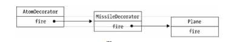

# 装饰者模式
装饰者模式可以动态地给某个对象添加一些额外的职责，而不会影响从这个类中派生的其他对象。

应用场景：

* `counterxing`写了一堆辣鸡代码，然后他跑路回学校毕业去了。`giminzeng`接手了他的辣鸡代码，发现他写的函数根本就看不懂，甚至可能还用了`a`、`b`、`c`这种变量命名方式，还可能没有注释。`giminzeng`想给这些代码增添新功能，又不想直接去覆盖之前的代码，于是使用装饰者模式，动态地给某个对象添加一些额外的职责。
* 我们想给`window`绑定`onload`事件，但是又不确定这个事件是不是已经被其他人绑定过，为了避免覆盖掉之前的`window.onload`函数中的行为，我们一般都会先保存好原先的`window.onload`，把它放入新的`window.onload`里执行。

**为何不使用继承？**

* 导致超类和子类之间存在强耦合性，当超类改变时，子类也会随之改变;
* 超类的内部细节是对子类可见的，继承常常被认为破坏了封装性;
* 可能会创建出大量的子类，使子类的数量呈爆炸性增长。

例如：现在有`4`种型号的自行车，我们为每种自行车都定义了一个单独的类。要给每种自行车都装上前灯、尾 灯和铃铛这3种配件。如果使用继承的方式来给每种自行车创建子类，则需要`4 × 3 = 12`个子类。 但是如果把前灯、尾灯、铃铛这些对象动态组合到自行车上面，则只需要额外增加`3`个类。

给对象动态地增加职责的方式称为装饰者(`decorator`)模式。装饰者模式能够在不改变对象自身的基础上，在程序运行期间给对象动态地添加职责。


## 15.1模拟传统面向对象语言的装饰者模式
作为一门解释执行的语言，给`JavaScript`中的对象动态添加或者改变职责是一件再简单不过的事情，虽然这种做法改动了对象自身，跟传统定义中的装饰者模式并不一样，但这无疑更符合`JavaScript`的语言特色。

```javascript
var obj = {
  name: 'sven',
  address: '深圳市'
};
obj.address = obj.address + '福田区';
```

传统面向对象语言中的装饰者模式在`JavaScript`中适用的场景并不多，如上面代码所示，通常我们并不太介意改动对象自身模拟一下传统面向对象语言中的`装饰者模式`实现。

假设我们在编写一个飞机大战的游戏，随着经验值的增加，我们操作的飞机对象可以升级成更厉害的飞机，一开始这些飞机只能发射普通的子弹，升到第二级时可以发射导弹，升到第三级时可以发射原子弹。

```javascript
// 定义飞机类
var Plane = function() {};
Plane.prototype.fire = function() {
  console.log('发射普通子弹');
};

// 增加两个装饰类，分别是导弹和原子弹

// 装饰导弹
var MissileDecorator = function(plane) {
  this.plane = plane;
}
MissileDecorator.prototype.fire = function() {
  this.plane.fire(); // 调用其本身的fire方法
  console.log('发射导弹');
}
// 装饰原子弹
var AtomDecorator = function(plane) {
  this.plane = plane;
}
AtomDecorator.prototype.fire = function() {
  this.plane.fire(); // 调用其本身的fire方法
  console.log('发射原子弹');
}
var plane = new Plane();
plane = new MissileDecorator(plane); // 装饰上导弹装饰类
plane = new AtomDecorator(plane); // 装饰上原子弹装饰类
plane.fire(); // 分别输出: 发射普通子弹、发射导弹、发射原子弹
```

导弹类和原子弹类的构造函数都接受参数`plane`对象，并且保存好这个参数，在它们的`fire`方法中，除了执行自身的操作之外，还调用`plane`对象的`fire`方法。

这种给对象动态增加职责的方式，并没有真正地改动对象自身，而是将对象放入另一个对象之中，这些对象以一条链的方式进行引用，形成一个聚合对象。这些对象都拥有相同的接口(`fire`方法)，当请求达到链中的某个对象时，这个对象会执行自身的操作，随后把请求转发给链中的下一个对象。

因为装饰者对象和它所装饰的对象拥有一致的接口，所以它们对使用该对象的客户来说是**透明**的，被装饰的对象也并不需要了解它曾经被装饰过，这种透明性使得我们可以递归地嵌套任意多个装饰者对象。

> 我的理解：好比我在玩英雄联盟/王者荣耀，我通过给我的英雄加点、带天赋、符文等，并没有改变我这个英雄本身，对外也是透明的(我还是使用的这个英雄)，还可以穿多个装备加多次点。但是在对战过程中，装备好的把装备差的击杀了，恰好正证明了我通过装饰增加了功能。



## 15.3回到JavaScript的装饰者
`JavaScript`语言动态改变对象相当容易，我们可以直接改写对象或者对象的某个方法，并不需要使用`类`来实现装饰者模式。

```javascript
// 定义飞机
var plane = {
  fire: function() {
    console.log('发射普通子弹');
  }
}
// 定义发射导弹函数
var missileDecorator = function() {
  console.log('发射导弹');
}
// 定义发射原子弹函数
var atomDecorator = function() {
  console.log('发射原子弹');
}
// 拿到发射子弹函数
var fire1 = plane.fire;
// 重写函数，除了调用原函数，还调用装饰函数
plane.fire = function() {
  fire1();
  missileDecorator();
}
var fire2 = plane.fire;
plane.fire = function() {
  fire2();
  atomDecorator();
}
plane.fire(); // 分别输出: 发射普通子弹、发射导弹、发射原子弹
```

## 15.4装饰函数
要想为函数添加一些功能，最简单粗暴的方式就是直接改写该函数。

```javascript
var a = function() {
  console.log(1);
}
var a = function() {
  console.log(1);
  console.log(2);
}
```

显然不可行！违背**开放-封闭原则(封装变化、降低耦合)**

通过保存原引用的方式就可以改写某个函数。(上边的做法就是这么做的)

```javascript
var a = function() {
  console.log(1);
}
var _a = a;

a = function() {
  _a();
  console.log(2);
}
a(); // 依次输出1、2
```

回到最开始说的那种应用场景：

```javascript
window.onload = function() {
  console.log(1);
}
var _onload = window.onload || function() {};
window.onload = function() {
  _onload();
  console.log(2);
}
```

存在一些问题：

* 必须维护`_onload`这个中间变量，虽然看起来并不起眼，但如果函数的装饰链较长，或者需要装饰的函数变多，这些中间变量的数量也会越来越多。
* 遇到了`this`被劫持的问题，在`window.onload`的例子中没有这个烦恼，是因为调用普通函数`_onload`时，`this`也指向`window`，跟调用`window.onload`时一样(函数作为对象的方法被调用时，`this`指向该对象，所以此处`this`也只指向`window`)。现在把`window.onload`换成`document.getElementById`，代码如下:

```javascript
var _getElementById = document.getElementById;
document.getElementById = function(id) {
  console.log(1);
  return _getElementById(id);
}
var button = document.getElementById('button'); // 报错，详情见第二章讲义：丢失的this
```

解决办法，使用`apply`。

```javascript
var _getElementById = document.getElementById;
document.getElementById = function() {
  console.log(1);
  return _getElementById.apply(document, arguments);
}
var button = document.getElementById('button');
```

## 15.5 用AOP装饰函数（具体可见之前第三章讲义的AOP相关内容）

AOP的主要作用是把一些跟核心业务逻辑模块无关的功能抽离出来，这些跟业务逻辑模块无关的功能通常包括：日志统计、安全控制、异常处理等。把这些功能抽离出来之后，再通过“动态织入”的方式掺入业务逻辑模块中。

```javascript
Function.prototype.before = function(beforefn) {
  var self = this; // 保存原函数的引用
  return function() {
    beforefn.apply(this, arguments); // 先执行新函数，修正this
    return self.apply(this, arguments); // 再执行原函数
  }
}

Function.prototype.after = function(afterfn) {
  var self = this;
  return function() {
    var ret = self.apply(this, arguments); // 先执行原函数
    afterfn.apply(this, arguments); // 再执行新函数
    return ret;
  }
}

var func = function() {
  console.log(2);
}

func = func.before(function() {
  console.log(1);
}).after(function() {
  console.log(3);
});
func(); // 依次输出1，2，3
```

再回到`window.onload`的例子，看看用`Function.prototype.before`来增加新的`window.onload`事件是多么简单:

```javascript
window.onload = function() {
  console.log(1);
}
window.onload = (window.onload || function() {}).after(function() {
  console.log(2);
}).after(function() {
  console.log(3);
}).after(function() {
  console.log(4);
});

```

不污染原型：

```javascript
var before = function(fn, beforefn) {
  return function() {
    beforefn.apply(this, arguments);
    return fn.apply(this, arguments);
  }
}
var a = before(function() {
  console.log(3);
}, function() {
  console.log(2);
});

a = before(a, function() {
  console.log(1);
});
a();

```

## 15.6 AOP 的应用实例
### 数据统计上报（解耦）
分离业务代码和数据统计代码，无论在什么语言中，都是`AOP`的经典应用之一。

页面中有一个登录 button，点击这个`button`会弹出登录浮层，与此同时要进行数据上报，来统计有多少用户点击了这个登录`button`

`open example1-0.html`

```html
<!DOCTYPE html>
<html lang="en">
<head>
  <meta charset="UTF-8">
  <title>Document</title>
</head>
<body>
  <button tag="login" id="button">点击打开登录浮层</button>
  <script>
    var showLogin = function() {
      console.log('打开登录浮层');
      log(this.getAttribute('tag'));
    }
    var log = function(tag) {
      console.log('上报标签为: ' + tag);
      // 真正的上报代码略(ajax)
      // (new Image).src = 'http:// xxx.com/report?tag=' + tag;
    }
    document.getElementById('button').onclick = showLogin;
  </script>
</body>
</html>
```

我们看到在`showLogin`函数里，既要负责打开登录浮层，又要负责数据上报，这是两个层面的功能，在此处却被耦合在一个函数里。使用`AOP`分离：

`open example1-1.html`

```html
<!DOCTYPE html>
<html lang="en">
<head>
  <meta charset="UTF-8">
  <title>Document</title>
</head>
<body>
  <button tag="login" id="button">点击打开登录浮层</button>
  <script>
    Function.prototype.after = function(afterfn) {
      var __self = this;
      return function() {
        var ret = __self.apply(this, arguments);
        afterfn.apply(this, arguments);
        return ret;
      }
    };
    var showLogin = function() {
      console.log('打开登录浮层');
    }
    var log = function() {
      console.log('上报标签为: ' + this.getAttribute('tag'));
      // 真正的上报代码略(ajax)
      // (new Image).src = 'http:// xxx.com/report?tag=' + tag;
    }
    showLogin = showLogin.after(log); // 打开登录浮层之后上报数据
    document.getElementById('button').onclick = showLogin;
  </script>
</body>
</html>
```

### 用AOP动态改变函数的参数（装饰原函数参数）
观察`Function.prototype.before`方法:

```javascript
Function.prototype.before = function(beforefn) {
  var __self = this;
  return function() {
    beforefn.apply(this, arguments);
    return __self.apply(this, arguments);
  }
}
```

`beforefn`和原函数`__self`共用一组参数列表`arguments`，当我们在`beforefn`的函数体内改变`arguments`的时候，原函数`__self`接收的参数列表自然也会变化。

下面的例子展示了如何通过`Function.prototype.before`方法给函数`func`的参数`param`动态地添加属性`b`：

```javascript
var func = function(param) {
  console.log(param); // 输出: {a: "a", b: "b"}
}
func = func.before(function(param) {
  param.b = 'b';
});
func({
  a: 'a'
});
```

现在有一个用于发起`Ajax`请求的函数，这个函数负责项目中所有的`Ajax`异步请求:

```javascript
var ajax = function(type, url, param) {
  console.dir(param);
  // 发送 ajax 请求的代码略
};
ajax('get', 'http:// xxx.com/userinfo', {
  name: 'sven'
});
```

解决`CSRF`攻击最简单的一个办法就是在`HTTP`请求中带上一个`Token`参数：

用于给`Ajax`请求添加`Token`：

```javascript
// 生成Token的函数
var getToken = function() {
  return 'Token';
}

var ajax = function(type, url, param) {
  param = param || {};
  param.Token = getToken();
  console.log('发送ajax请求');
};
```

虽然已经解决了问题，但我们的`ajax`函数相对变得僵硬了，每个从`ajax`函数里发出的请求 都自动带上了`Token`参数，虽然在现在的项目中没有什么问题，但如果将来把这个函数移植到其他项目上，或者把它放到一个开源库中供其他人使用，`Token`参数都将是多余的。

使用`AOP`：

```javascript
var ajax = function(type, url, param) {
  console.log(param);
  console.log('发送ajax请求');
};

var getToken = function() {
  return 'Token';
}

ajax = ajax.before(function(type, url, param) {
  param.Token = getToken();
});

ajax('get', 'http:// xxx.com/userinfo', {
  name: 'sven'
});
```

### 插件式的表单验证

项目中存在非常多的表单，如`注册`、`登录`、`修改用户信息`等。在表单数据提交给后台之前，常常要做一些校验，比如登录的时候需要验证用户名和密码是否为空。

`open example2-0.html`

```html
<!DOCTYPE html>
<html lang="en">
<head>
  <meta charset="UTF-8">
  <title>Document</title>
</head>
<body>
  用户名:<input id="username" type="text"/>
  密码: <input id="password" type="password"/>
  <input id="submitBtn" type="button" value="提交">
  <script>
    var username = document.getElementById('username'),
      password = document.getElementById('password'),
      submitBtn = document.getElementById('submitBtn');
    var formSubmit = function() {
      if (username.value === '') {
        return alert('用户名不能为空');
      }
      if (password.value === '') {
        return alert('密码不能为空');
      }
      var param = {
        username: username.value,
        password: password.value
      }
      console.log('发送ajax' + 'http:// xxx.com/login', param);
    }
    submitBtn.onclick = function() {
      formSubmit();
    }
  </script>
</body>
</html>
```

`formSubmit`函数在此处承担了两个职责，除了提交`ajax`请求之外，还要验证用户输入的合法
性。这种代码一来会造成函数臃肿，职责混乱，二来谈不上任何可复用性。 我们的目的是分离校验输入和提交`ajax`请求的代码，我们把校验输入的逻辑放到`validata`函数中，并且约定当`validata`函数返回`false`的时候，表示校验未通过:

```javascript
var validata = function() {
  if (username.value === '') {
    alert('用户名不能为空');
    return false;
  }
  if (password.value === '') {
    alert('密码不能为空');
    return false;
  }
}
var formSubmit = function() {
  // 在表单提交函数内也计算了一次
  if (validata() === false) {
    return;
  }
  var param = {
    username: username.value,
    password: password.value
  }
  console.log('发送ajax2' + 'http:// xxx.com/login', param);
}
submitBtn.onclick = function() {
  formSubmit();
}
```

使用`AOP`，使`validata`和`formSubmit`完全分离开来：

我们重写`before`，如果`beforefn`的执行结果返回`false`，表示不再执行后面的原函数。

```javascript
Function.prototype.before = function(beforefn) {
  var __self = this;
  return function() {
    if (beforefn.apply(this, arguments) === false) {
      // beforefn返回false的情况直接return，不再执行后面的原函数
      return;
    }
    return __self.apply(this, arguments);
  }
}
var validata = function() {
  if (username.value === '') {
    alert('用户名不能为空');
    return false;
  }
  if (password.value === '') {
    alert('密码不能为空');
    return false;
  }
}
var formSubmit = function() {
  var param = {
    username: username.value,
    password: password.value
  }
  console.log('发送ajax3' + 'http:// xxx.com/login', param);
}
formSubmit = formSubmit.before(validata);
submitBtn.onclick = function() {
  formSubmit();
}
```


这样我们可以轻易地维护两块的功能。

值得注意的是，因为函数通过`Function.prototype.before`或者`Function.prototype.after`被装 饰之后，返回的实际上是一个新的函数，如果在原函数上保存了一些属性，那么这些属性会丢失。

```javascript
Function.prototype.before = function(beforefn) {
  var __self = this;
  return function() {
    beforefn.apply(this, arguments);
    return __self.apply(this, arguments);
  };
}
var func = function() {
  console.log(1);
}
func.a = 'a';
func = func.before(function() {
  console.log(func.a);
  console.log(2);
});
console.log(func.a); // 输出:undefined
```

书上没有给出解决方案，查阅网上资料也没找到，我猜想了一个解决方案，待探讨？

```javascript
Function.prototype.before = function(beforefn) {
  var __self = this;
  var result = function() {
    beforefn.apply(this, arguments);
    return __self.apply(this, arguments);
  };
  for(var item in this) { // 用for in 遍历可以遍历继承的可枚举和不可枚举属性
    result[item] = this[item];
  }
  return result;
}
var func = function() {
  console.log(1);
}
func.a = 'a';
func = func.before(function() {
  console.log(func.a);
  console.log(2);
});
console.log(func.a); // 输出:a
```

装饰方式也叠加了`函数的作用域`，如果装饰的链条过长，性能上也会受到一些影响。